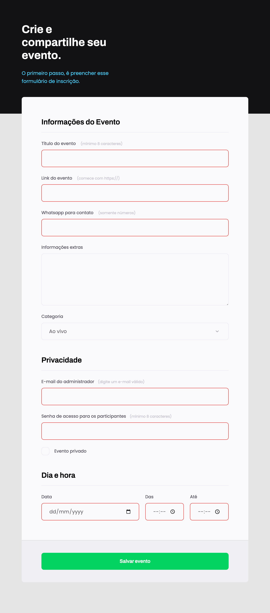

<h1 align="center">Projeto criação de formulário</h1>

Programa exclusivo do curso Explorer, promovido pela Rocketseat para ensino de tecnologias WEB.  
<a href="https://www.rocketseat.com.br/explorer">Conheça esse curso clicando aqui.</a>

  <a href="#-tecnologias">Tecnologias</a>&nbsp;&nbsp;&nbsp;|&nbsp;&nbsp;&nbsp;
  <a href="#-projeto">Projeto</a>&nbsp;&nbsp;&nbsp;|&nbsp;&nbsp;&nbsp;
  <a href="#-layout">Layout</a>&nbsp;&nbsp;&nbsp;|&nbsp;&nbsp;&nbsp;
  <a href="#memo-licença">Licença</a>

  

 

  

## 🚀 Tecnologias

Esse projeto foi desenvolvido com as seguintes tecnologias:

- HTML e CSS
- Git e Github
- Figma

## 💻 Projeto

O formulário é um agregador de dados, servindo para pesquisas ou cadastros em sites.

- [Acesse o projeto finalizado, online](https://graziela-redigolo.github.io/Projeto-03-formulario)

## 🔖 Layout

Layout desenvolvido pela Rocketseat.